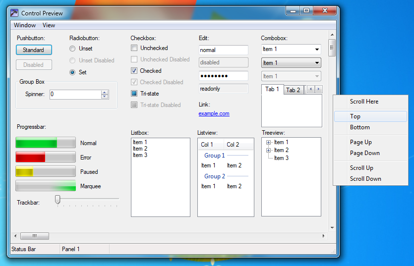

# Aero11

[Aero10](https://www.deviantart.com/vaporvance/art/909711949) faithfully ported to Windows 11, with the necessary changes to make it work properly.

Currently, only the Seven variant is ported.

*Made with permission from vaporvance.*

# Prerequisites

* You need to install a UxTheme patcher to allow custom `.msstyles` themes since Microsoft locks them out by default. Some options include the Windhawk mod [UXTheme hook](https://windhawk.net/mods/uxtheme-hook) and [SecureUxTheme](https://github.com/namazso/SecureUxTheme).
* To properly load ShellStyle mods, OldNewExplorer or the [UIFILE Override](https://windhawk.net/mods/uifile-override) Windhawk mod is needed.

# Installation

1. After patching UxTheme, download the latest release of the theme from [Releases](https://github.com/SandTechStuff/Aero11/releases) (Aero11.zip).
2. Extract the downloaded zip and place the contents in `C:\Windows\Resources\Themes`.

The file structure should resemble this:

- `C:`
	- `Windows`
		- `Resources`
			- `Themes`
				- `Aero11`
				- `Aero11_Seven.theme`
3. Either double click one of the `.theme` files from within the `Themes` folder or select your desired theme from within Windows settings.
4. The theme comes bundled with the Windows 7 wallpaper and accent color, but if you would prefer to use your own wallpapers or colors you can override anything through Windows personalization settings.

_Additional setup is needed to get an accurate Windows 7 look._
