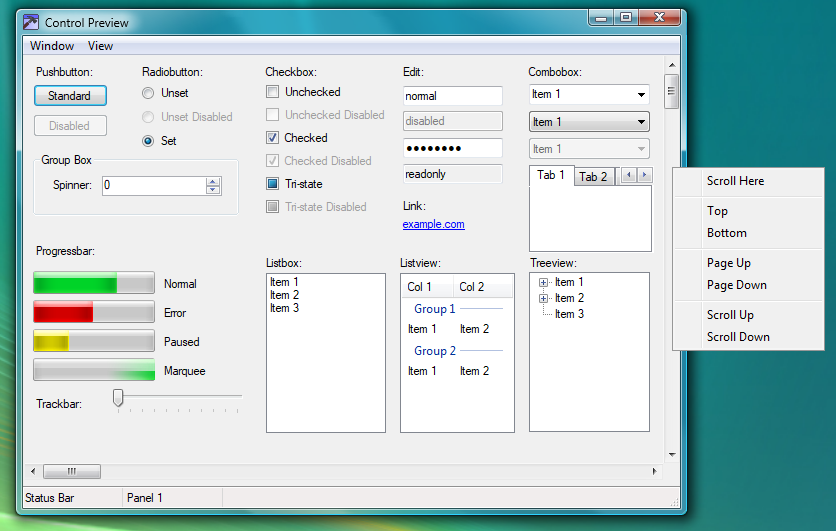

# Aero11: Metro

[Aero10](https://www.deviantart.com/vaporvance/art/Aero10-Metro-1006184615) faithfully ported to Windows 11, with the necessary changes to make it work properly.

This branch houses the Windows 8.x version of Aero11, all available versions are listed below.

[Aero11: Seven](https://github.com/SandTechStuff/Aero11/tree/aero11_seven) | [Aero11: Vista](https://github.com/SandTechStuff/Aero11/tree/aero11_vista) | [Aero11: Metro](https://github.com/SandTechStuff/Aero11/tree/aero11_metro)

*Made with permission from vaporvance.*

# Prerequisites

* You need to install a UxTheme patcher to allow custom `.msstyles` themes since Microsoft locks them out by default. Some options include the Windhawk mod [UXTheme hook](https://windhawk.net/mods/uxtheme-hook) and [SecureUxTheme](https://github.com/namazso/SecureUxTheme).
* To properly load ShellStyle mods, OldNewExplorer or the [UIFILE Override](https://windhawk.net/mods/uifile-override) Windhawk mod is needed.

# Installation

1. After patching UxTheme, download the latest release of the theme from [Releases](https://github.com/SandTechStuff/Aero11/releases) (Aero11.zip).
2. Extract the downloaded zip and place the contents in `C:\Windows\Resources\Themes`.
3. Either double click one of the `.theme` files from within the `Themes` folder or select your desired theme from within Windows settings.
4. The theme comes bundled with the Windows 8.x wallpaper and accent color, but if you would prefer to use your own wallpapers or colors you can override anything through Windows personalization settings.

_Additional setup is needed to get an accurate Windows 8.x look._
